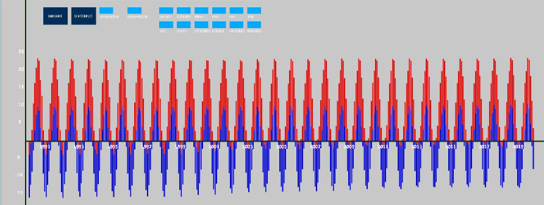
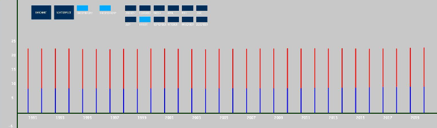
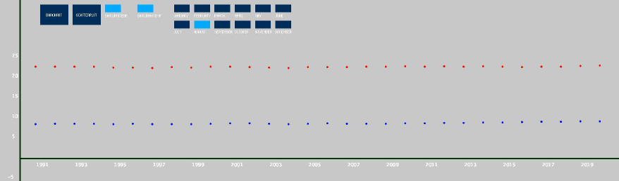

#  Data Visualization
Programming Language: Processing 

Library: ControlP5 library was imported for controlling buttons 


## Installation

Install Data Visualization project by downloading all files into one directory  
Follow the steps below to import Library 

```bash
 1. Open Processing IDE
 2. Go to Sketch
 3. Click Import Library
 4. Then Click on Add Library
 5. Type the following on the search bar: ControlP5 
 6. Click Install
Click the run button on Processing toolbar to run the project 


```
## Purpose 
This project can display Bar chart and Scatter point plot that shows data of average daily minimum and maximum temperatures for each month for about 30 years for the City of Calgary. Also, users are able to view data for select months and maximum and minimum temperature will be shown.

## Images of the Project

<p align="center">
<alt="Material Bread logo">
 Figure 1- Simple Overview of the Project interface
</p>

 
<p align="center">
<alt="Material Bread logo">
Figure 2- Bar Chart representing data of August for each year
</p>

 
<p align="center">
<alt="Material Bread logo">
 Figure 3-Scatter point plot representing data of August for each year
</p>

## Challenges and Solution
One of the challenges I faced the number in the y-axis was not even spaced
The solution was to have each number evenly spaced by using a scale

Last challenge that I faced was initially the program was written in class and this was making the program very lengthy and hard to debug
The solution was to create sperate classes and have all related functionalities there

I have learned that using loops, arrays, functions, and conditional statements can create a relatively large software project design
